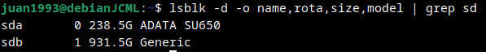
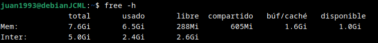
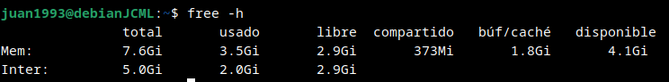
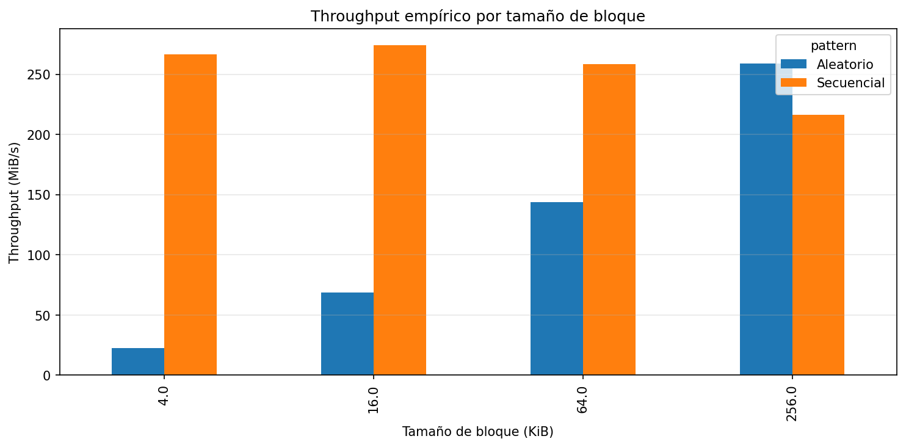
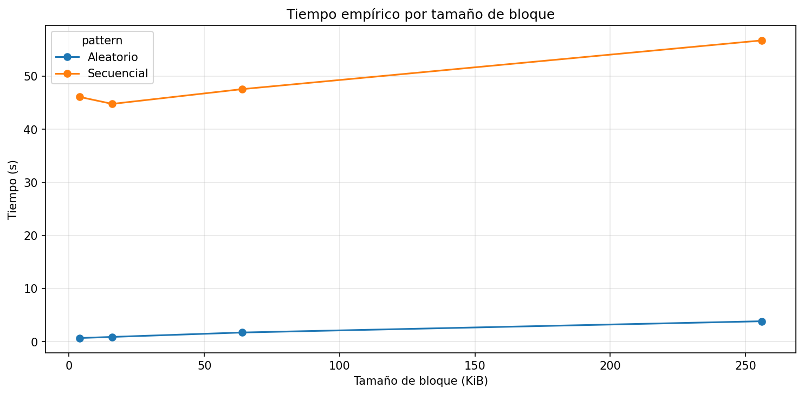
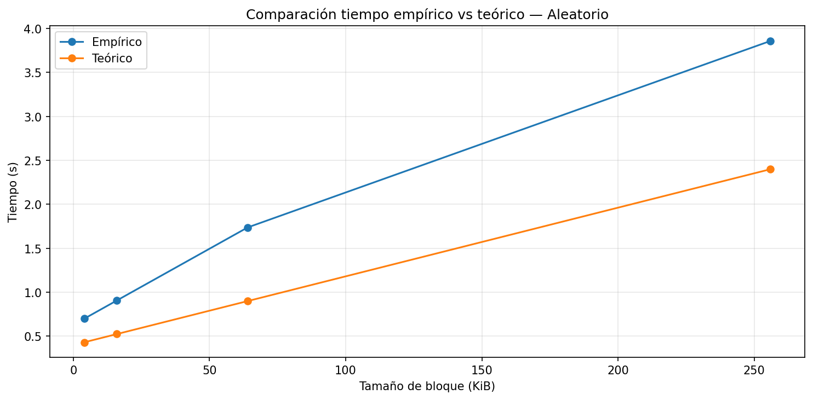
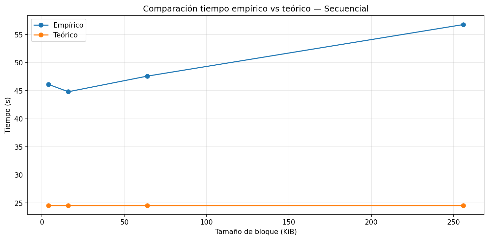
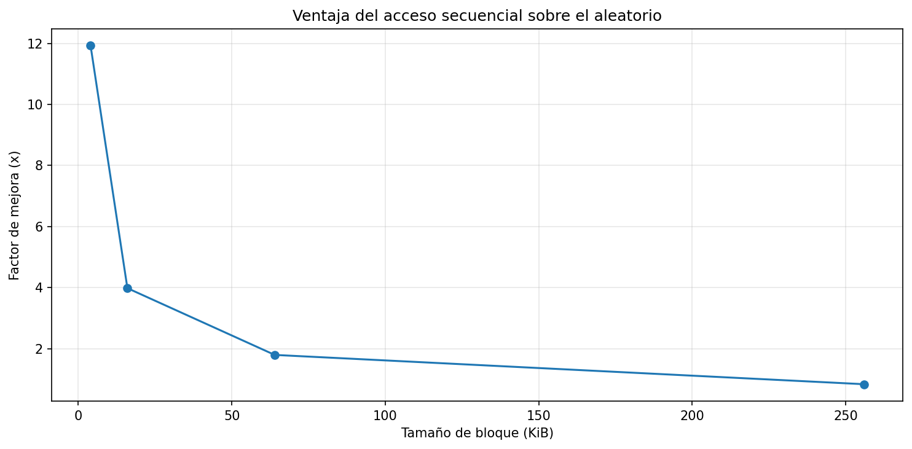

# Laboratorio — Almacenamiento en disco y desempeño de I/O

- Juan Camilo Moná Luján
- jcamilo.mona@udea.edu.co

## Preparacion

### Identificación del disco

### Cache libre y RAM

## Punto de control 1 — Revisión conceptual

**1. ¿Qué representa la latencia en este laboratorio?**  
La latencia representa el tiempo de respuesta o el tiempo de acceso en una operación de lectura o escritura en el disco, desde que se realiza la solicitud hasta que comienza la transferencia de datos.

**2. ¿Qué representa el throughput?**  
El throughput (ancho de banda) es la cantidad total de información transferida por unidad de tiempo, es decir, la tasa de transferencia de bytes del disco durante una operación de lectura o escritura.

**3. ¿Por qué en acceso secuencial normalmente se asume que M ≈ 1?**  
Porque solo el primer bloque paga el costo de acceso (seek + latencia); los bloques contiguos no requieren un nuevo posicionamiento, por lo que el número de accesos no contiguos (M) es aproximadamente 1.

**4. ¿Por qué en acceso aleatorio M tiende a ser mayor?**  
Cada bloque se encuentra en una posición diferente, obligando a reposicionar el cabezal (o a un nuevo acceso en SSD) para cada operación. Así, M es aproximadamente igual al número de bloques leídos.

## Punto de control 2 — Reflexión sobre la configuración

**1. Tamaño del archivo: ¿Es suficiente para superar la caché RAM de su equipo?**  
No. Mi equipo tiene 7.6 GiB de RAM y memoria disponible de 1.0 GiB. El archivo de 512 MiB es menor que la memoria disponible, por lo que cabe completamente en la caché del sistema operativo. Para superar la caché se necesitaría un archivo mayor a 8 GiB.

**2. Tamaño de bloque: ¿cuál esperaría que tuviera mejor rendimiento en acceso aleatorio y por qué?**  
El bloque de 256 KB debería dar el mejor rendimiento en acceso aleatorio, porque reduce el número de operaciones de E/S (M) para una misma cantidad de datos, amortiguando la latencia fija por acceso.

**3. Entorno de ejecución: ¿local o Google Colab?**  
Ejecuto en local (Debian). Las mediciones reflejan el hardware de mi equipo, no el de servidores de Google.

## Analice (propósito del archivo)

**1. ¿Qué papel cumple este archivo dentro del experimento?**  
Es el conjunto de datos de prueba sobre el que se miden los patrones de acceso (secuencial y aleatorio) con distintos tamaños de bloque. Permite calcular tiempos de lectura, throughput y latencia efectiva.

**2. ¿Por qué es útil trabajar con un archivo relativamente grande?**  
Porque puede superar la caché del SO y forzar lecturas reales al disco, da estabilidad a las mediciones (tiempos largos y repetibles) y simula condiciones de trabajo de bases de datos reales donde los datasets no caben completamente en RAM.

**3. ¿Qué ocurriría si el archivo fuera demasiado pequeño?**  
El archivo completo cabría en la **caché del sistema operativo**, las lecturas posteriores se servirían desde RAM y no desde el disco, ocultando las diferencias entre patrones de acceso y dando resultados que reflejan el rendimiento de la caché, no del dispositivo real.

## Análisis de resultados empíricos (tabla propia)

**1. ¿Cuál patrón de acceso fue más rápido para cada tamaño de bloque?**  
- 4 KiB, 16 KiB y 64 KiB → **secuencial** (hasta 12 veces más rápido).  
- 256 KiB → **aleatorio** (259.15 MiB/s vs 216.52 MiB/s).

**2. ¿El throughput cambió al aumentar el tamaño de bloque?**  
Sí. En secuencial se mantuvo alto (260–274 MiB/s) hasta 64 KiB y luego cayó a 216.5 MiB/s. En aleatorio creció sostenidamente: 22.34 (4 KiB) → 68.90 (16 KiB) → 143.90 (64 KiB) → 259.15 (256 KiB).

**3. ¿En qué caso observó la mayor diferencia entre secuencial y aleatorio?**  
Con bloque de 4 KB: el secuencial fue **12 veces más rápido** (266.55 vs 22.34 MiB/s). La diferencia se reduce hasta invertirse en 256 KB.

## Punto de control 3 — Modelo teórico elegido

- **Dispositivo modelado:** SSD SATA  
- **Latencia asumida:** 100 µs (`100e-6` s)  
- **Throughput asumido:** 500 MB/s (`500 * 1024²` bytes/s)  

Este modelo se aproxima a un SSD SATA de gama media, pero mi SSD ADATA 256 GB real (gama de entrada) no alcanza los 500 MB/s, por lo que el modelo es optimista.

## Análisis comparativo: teoría vs práctica

**1. ¿Los tiempos empíricos son mayores o menores que los teóricos?**  
Mayores en todos los casos. El SSD real es entre 1.6 y 2.3 veces más lento que el modelo teórico.

**2. ¿En cuál patrón de acceso la teoría se aproxima mejor?**  
En acceso aleatorio, especialmente con bloques de 4 KB (ratio 1.62) y 256 KB (ratio 1.61). En secuencial los ratios son más altos (1.82–2.31).

**3. ¿Qué factores reales podrían explicar las diferencias?**  
- **Throughput real inferior al nominal:** el SSD alcanzó ~274 MB/s como máximo, lejos de los 500 MB/s supuestos.  
- **Latencia real mayor a 100 µs:** la sobrecarga del controlador, la capa FTL y las llamadas al sistema aumentan el tiempo efectivo.  
- **Caché del SO y efecto de múltiples pasadas:** aunque el archivo es pequeño, las pruebas secuenciales leen 12.88 GB, y la caché no logra ocultar por completo la lentitud del dispositivo.

## Interpretación de gráficas

### Gráfica de throughput

- **Barras más altas:** las de acceso secuencial en 4, 16 y 64 KiB. En 4 KiB, secuencial ≈265 MiB/s vs aleatorio ≈22 MiB/s.  
- **Significado:** el acceso secuencial aprovecha mejor la localidad espacial y el prefetching.  
- **Patrón que aprovecha mejor la lectura en bloques:** el secuencial, especialmente con bloques pequeños (4 KiB, 12× más rápido). En 256 KiB el aleatorio supera ligeramente al secuencial.

### Gráfica de tiempo

El tiempo secuencial se mantiene entre 44 y 57 segundos (para 12.88 GB), mientras que el aleatorio crece de 0.7 s (4 KiB) a 3.86 s (256 KiB). La mayor divergencia absoluta ocurre en 256 KiB (≈52 s de diferencia). La mayor diferencia relativa se da en 4 KiB (el secuencial tarda ~46 s, el aleatorio ~0.7 s).

### Comparación empírico vs teórico

1. **Tendencia similar:** en aleatorio ambas curvas crecen linealmente; en secuencial el teórico es constante (~24.5 s) mientras el empírico crece.  
2. **Mayor separación:** en secuencial a 256 KiB (56.75 s empírico vs 24.58 s teórico).  
3. **El modelo subestima el tiempo real**, especialmente en secuencial. La razón principal es que el throughput real del SSD es casi la mitad del modelado.

### Ventaja del acceso secuencial (speedup)

- **Mayor factor de mejora:** **12×** (con bloque de 4 KiB).  
- **Cambio con el tamaño de bloque:**  
  - 4 KiB → 12×  
  - 16 KiB → 4×  
  - 64 KiB → 1.8×  
  - 256 KiB → 0.9× (ventaja invertida, ahora es más rápido el aleatorio)  
- **Implicación para el diseño de software:**  
  - Usar acceso secuencial con bloques de 4–16 KiB para máximo rendimiento en lecturas masivas.  
  - Evitar acceso aleatorio con bloques pequeños (pérdida de hasta 12×).  
  - Para transferencias muy grandes, el tamaño de bloque importa más que el patrón; bloques de 256 KB igualan o mejoran el rendimiento incluso en acceso aleatorio.  
  - Favorecer estructuras de datos contiguas en disco (arrays, archivos planos) sobre estructuras dispersas cuando el rendimiento de lectura sea crítico.

## Preguntas de cierre

### 1. Comparación de patrones: ¿cuántas veces más rápido fue el acceso secuencial respecto al aleatorio en su equipo? ¿Resultado esperado?

En mi equipo, la mayor diferencia se observó con bloques de **4 KiB**: el throughput secuencial fue **266.55 MiB/s** frente a **22.34 MiB/s** del aleatorio, lo que representa un factor de **~11,9 veces** más rápido. Conforme aumentó el tamaño de bloque, la ventaja se redujo hasta desaparecer: en 256 KiB el acceso aleatorio (259.15 MiB/s) superó al secuencial (216.52 MiB/s).

**Resultado esperado:** Sí, era esperable que el acceso secuencial fuese mucho más rápido en bloques pequeños, debido a que evita latencias de posicionamiento. La teoría predice que con bloques grandes el aleatorio puede acercarse e incluso superar al secuencial en algunos SSD, como ocurrió.

### 2. Efecto del tamaño de bloque en el throughput aleatorio

El throughput del acceso aleatorio **aumentó significativamente** al incrementar el tamaño de bloque:

| Tamaño bloque | Throughput aleatorio (MiB/s) |
|---------------|------------------------------|
| 4 KiB         | 22.34                        |
| 16 KiB        | 68.90                        |
| 64 KiB        | 143.90                       |
| 256 KiB       | 259.15                       |

**Explicación:** Cada operación aleatoria paga una latencia fija (tiempo de acceso al inicio del bloque). Al usar bloques más grandes, se transfieren más bytes por cada latencia pagada, lo que mejora el throughput efectivo. Además, el controlador del SSD puede paralelizar internamente lecturas grandes.

### 3. Teoría vs práctica: caso donde la medición empírica se alejó del modelo teórico

Tomemos el caso **secuencial con bloque de 256 KiB**:
- Tiempo teórico (modelo SSD SATA: 100 µs latencia, 500 MB/s throughput): **24.58 s**
- Tiempo empírico: **56.75 s** (2.31 veces mayor)

**Factor atribuible:** El modelo supone un throughput de 500 MB/s, pero el SSD real (ADATA 256 GB) alcanzó como máximo **274 MiB/s** (~287 MB/s) en las pruebas. Esto se debe a que es un SSD SATA de gama de entrada, con controlador y memoria NAND más lentos (posiblemente TLC o QLC). Además, la latencia real efectiva fue superior a 100 µs por la sobrecarga del sistema de archivos y las llamadas al sistema.

### 4. Tipo de disco: comparación con valores de referencia

| Dispositivo     | Latencia típica | Throughput secuencial |
|----------------|----------------|----------------------|
| HDD            | 10 ms          | ~100 MB/s            |
| SSD SATA       | 100 µs         | ~500 MB/s            |
| SSD NVMe       | 10-50 µs       | 3-5 GB/s             |
| **Mi equipo**  | ~175 µs (medido en 4KB aleatorio) | **~274 MB/s** |

**Conclusión:** Mi equipo se comporta como un **SSD SATA de gama media-baja**. No alcanza los 500 MB/s nominales, pero está muy por encima de un HDD (100 MB/s) y lejos de un NVMe (GB/s). La latencia efectiva (~175 µs) es algo superior a la teórica de 100 µs, pero aún así dos órdenes de magnitud mejor que un HDD.

### 5. Aplicación práctica: tabla de estudiantes con 1 millón de registros

**Preferiría leer toda la tabla de forma secuencial** en lugar de acceder a registros individuales de forma aleatoria.

**Razones basadas en los resultados:**
- El acceso secuencial alcanza ~270 MB/s, mientras que el aleatorio con bloques pequeños (típicos de registro individual, ej. 4KB) solo da ~22 MB/s → **12 veces más lento**.
- Si necesito procesar toda la tabla (ej. generar un reporte, calcular agregados), la lectura secuencial minimiza el tiempo total.
- Si solo se requiere acceder a unos pocos registros, podría ser mejor usar un índice (que reduce el número de accesos aleatorios) o agrupar consultas para leer bloques más grandes (ej. 256 KB) donde el aleatorio es competitivo.

**En resumen:** Para operaciones masivas (full scan), siempre secuencial. Para consultas puntuales, se debe diseñar un esquema que agrupe los registros en bloques grandes para amortiguar la latencia del acceso aleatorio.